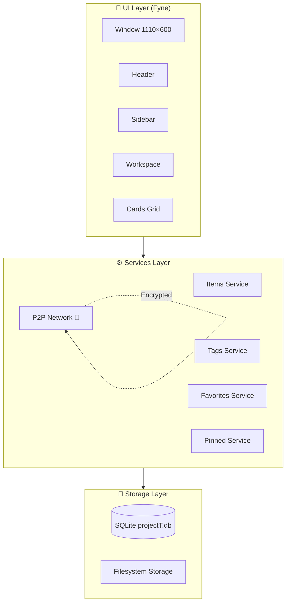
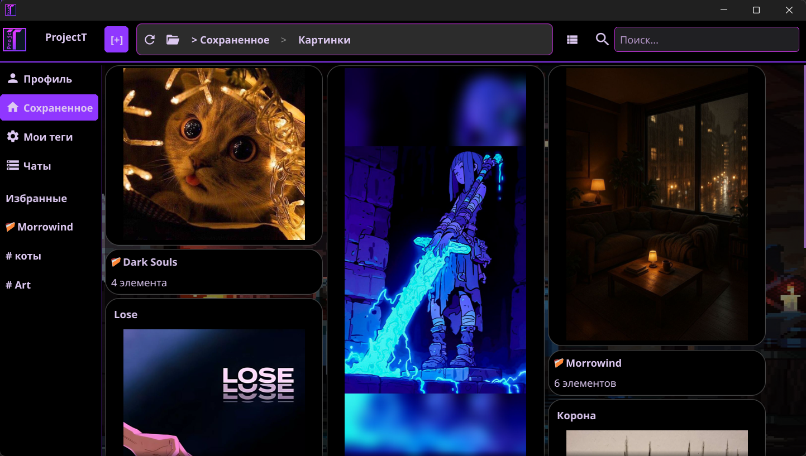

<div align="center">

# ProjectT

### 🗂️ Гибрид Проводника и Pinterest на стероидах

[](https://go.dev/)
[](https://fyne.io/)
[](https://libp2p.io/)
[](LICENSE)

**Локальное пространство для коллекций, где файлы, ссылки и тексты существуют едиными карточками с гибкой системой тегов и визуальной сеткой**

</div>

---

## 📖 О проекте

> [!IMPORTANT]
> Это **личное пространство для коллекций**, где файлы, ссылки и тексты существуют не отдельными файлами, а **едиными карточками** с гибкой системой тегов и визуальной сеткой как у Pinterest.
>
> В отличие от проводника, здесь не нужно создавать десяток `.txt` и папок, чтобы сохранить ссылку с описанием и картинкой, а в отличие от Pinterest — **можно хранить любые форматы**, включая стихи, документы и чужие видео.
>
> 🔮 **В дипломной версии добавляется P2P-сеть**: пользователи смогут обмениваться коллекциями напрямую, без центрального сервера, организуя приватные сообщества по интересам, где данные остаются у людей, а не у корпораций.

### 💡 Философия

<div align="center">

> **Это гибрид Проводника и Pinterest на стероидах**, где объекты живут как смысловые единицы, а не как разрозненные файлы, и с P2P-обменом, чтобы делиться коллекциями без потери приватности.

</div>

---

## ✨ Возможности

### 🎨 Основное
<table>
<tr>
<td width="50%">

#### 📌 Карточки-контейнеры
- Единый формат для файлов, ссылок, текста и изображений
- Визуальная сетка в стиле Pinterest
- Гибкая система тегов для категоризации

</td>
<td width="50%">

#### 🏷️ Умная организация
- Теги вместо папок
- Избранные элементы
- Закреплённые карточки
- Сортировка по параметрам

</td>
</tr>
<tr>
<td width="50%">

#### 🗄️ Локальное хранилище
- SQLite для метаданных
- Файловая система для контента
- Резервное копирование
- Быстрый поиск

</td>
<td width="50%">

#### 🎯 UI/UX
- Современный интерфейс на Fyne
- Тёмная/светлая тема
- Адаптивное окно 1110×600
- Интуитивное управление

</td>
</tr>
</table>

### 📡 P2P-функциональность (в разработке)

> [!NOTE]
> P2P-модуль находится в активной разработке. Следите за обновлениями!

<details>
<summary><b>🔮 Запланированные возможности (нажмите для раскрытия)</b></summary>

#### 🌐 Децентрализованная сеть
- **Прямое соединение** между пользователями без серверов
- **Шифрование трафика** через Noise Protocol
- **NAT Traversal** для работы за домашними роутерами
- **DHT + mDNS** для обнаружения пиров

#### 💬 Чат и обмен
- **Личные сообщения** 1-на-1 с историей
- **Передача файлов** и изображений
- **Статусы контактов** (онлайн/оффлайн)
- **Приватные коллекции** для избранных контактов

#### 🔐 Безопасность
- **Криптографические ключи** для идентификации
- **Приватные сообщества** по интересам
- **Блокировка нежелательных контактов**
- **Данные остаются у пользователей**, а не у корпораций

</details>

---

## 🚀 Быстрый старт

### Требования

| Компонент | Версия | Ссылка |
|-----------|--------|--------|
| **Go** | ≥ 1.25.0 | [Скачать](https://go.dev/dl/) |
| **OS** | Windows 10+ | — |
| **GPU** | DirectX 11+ | Для рендеринга Fyne |

### Установка

```bash
# 1. Клонируйте репозиторий
git clone https://github.com/YOUR_USERNAME/projectT.git
cd projectT

# 2. Установите зависимости
go mod download

# 3. Соберите проект
go build -o projectT.exe ./cmd/main.go

# 4. Запустите
./projectT.exe
```

> [!TIP]
> Убедитесь, что путь к проекту **не содержит пробелов и кириллицы** во избежание проблем с OpenGL.

---

## 📁 Структура проекта

```
projectT/
├── cmd/
│   └── main.go                    # Точка входа
│
├── internal/
│   ├── app/                       # Инициализация приложения
│   │   └── app.go
│   │
│   ├── services/                  # Бизнес-логика
│   │   ├── content_blocks_service.go
│   │   ├── items_service.go
│   │   ├── tags_service.go
│   │   ├── favorites/             # Избранное
│   │   ├── pinned/                # Закреплённые
│   │   ├── sort_settings/         # Сортировка
│   │   └── p2p/                   # 📡 P2P-сеть (WIP)
│   │
│   ├── storage/                   # Хранение данных
│   │   ├── database/              # SQLite модели и миграции
│   │   ├── filesystem/            # Файловое хранилище
│   │   └── files/                 # Контент пользователей
│   │
│   └── ui/                        # Графический интерфейс
│       ├── ui.go                  # Главный UI-контроллер
│       ├── theme/                 # Темы оформления
│       ├── header/                # Шапка окна
│       ├── sidebar/               # Боковая панель
│       ├── workspace/             # Рабочая область
│       ├── cards/                 # Виджеты карточек
│       ├── edit_item/             # Редактор элементов
│       └── layout/                # Компоновка сетки
│
├── assets/
│   ├── icons/                     # Иконки приложения
│   │   └── ProjctT.png
│   ├── background/                # Фоновые изображения
│   └── Magic Cards.ttf            # Шрифт
│
├── go.mod                         # Зависимости Go
├── README.md                      # Этот файл
└── P2P_IMPLEMENTATION_PLAN.md     # 📡 План разработки P2P
```

---

## 🛠️ Архитектура



### Компоненты

| Компонент | Описание |
|-----------|----------|
| **UI** | Fyne-приложение с кастомной темой, виджетами карточек и сеткой |
| **Services** | Бизнес-логика: CRUD элементов, тегов, избранного, закреплённых |
| **Storage** | SQLite для метаданных + файловая система для контента |
| **P2P** | 📡 libp2p для децентрализованного обмена (в разработке) |

---

## 📊 Используемые технологии

### Основные зависимости

```go
require (
    fyne.io/fyne/v2        v2.4.4    // GUI-фреймворк
    github.com/mattn/go-sqlite3  // SQLite драйвер
    golang.org/x/text      v0.34.0   // Работа с текстом
    
    // P2P стек (в разработке)
    github.com/libp2p/go-libp2p      v0.32.0
    github.com/libp2p/go-libp2p-kad-dht  v0.25.0
    github.com/libp2p/go-libp2p-pubsub  v0.10.0
    github.com/multiformats/go-multiaddr  v0.12.0
)
```

### Стек технологий

<div align="center">


</div>

---

## 📸 Скриншоты

> [!NOTE]
> Скриншоты будут добавлены после релиза первой версии.

<!--
<div align="center">


*Главное окно приложения с сеткой карточек*

</div>
-->

---

## 🔧 Конфигурация

### Структура хранилища

При первом запуске создаётся следующая структура:

```
projectT/
├── projectT.db              # База данных SQLite
├── storage/
│   ├── files/               # Файлы пользователей
│   ├── cache/               # Кэш изображений
│   └── temp/                # Временные файлы
└── assets/                  # Ресурсы приложения
```

### Таблицы базы данных

| Таблица | Описание |
|---------|----------|
| `items` | Карточки элементов (файлы, ссылки, текст) |
| `tags` | Теги для категоризации |
| `item_tags` | Связь элементов с тегами |
| `favorites` | Избранные элементы |
| `pinned` | Закреплённые карточки |
| `sort_settings` | Настройки сортировки |
| `p2p_profile` | 📡 P2P-профиль узла (ключи, PeerID) |
| `contacts` | 📡 Адресная книга контактов |
| `chat_messages` | 📡 История сообщений чата |
| `bootstrap_peers` | 📡 Узлы для входа в сеть |

---

## 🧪 Тестирование

```bash
# Запустить тесты
go test ./...

# Запустить тесты с покрытием
go test -cover ./...

# P2P тесты (отдельный модуль)
go run ./cmd/p2p_test/
```

---

## 🤝 Вклад в проект

> [!WARNING]
> Проект находится в активной разработке. P2P-функциональность ещё не завершена.

### Как помочь

1. **Форкните** репозиторий
2. **Создайте ветку** для фичи (`git checkout -b feature/amazing-feature`)
3. **Внесите изменения** и добавьте тесты
4. **Закоммитьте** (`git commit -m 'Add amazing feature'`)
5. **Отправьте** (`git push origin feature/amazing-feature`)
6. **Создайте Pull Request**

### План разработки

Полный план реализации P2P-функциональности доступен в файле [`P2P_IMPLEMENTATION_PLAN.md`](P2P_IMPLEMENTATION_PLAN.md)

---

## ❓ FAQ

### Не запускается приложение

**Проверьте:**
1. Установлен ли Go ≥ 1.25.0 (`go version`)
2. Запущены ли зависимости (`go mod download`)
3. Отсутствуют ли пробелы и кириллица в пути к проекту

### Ошибка OpenGL/DirectX

Fyne требует поддержки OpenGL 2.0+ или DirectX 11+:
- Обновите драйверы видеокарты
- Убедитесь, что GPU поддерживает OpenGL 2.0+

### Где хранятся данные?

- **Метаданные**: `projectT.db` (SQLite в корне проекта)
- **Файлы**: `storage/files/` (внутри проекта)

### Можно ли перенести коллекцию на другой ПК?

Да! Скопируйте папку проекта целиком или экспортируйте базу данных + файлы.

---

## 📄 Лицензия

<div align="center">

**MIT License**

Свободное использование, модификация и распространение.

[Посмотреть полный текст лицензии](LICENSE)

</div>

---

## 👨‍💻 Автор

<div align="center">

**ProjectT** — дипломный проект

*Локальное пространство для коллекций с P2P-обменом*

---

### ⭐ Если проект интересен — поставьте звезду!

[](https://github.com/YOUR_USERNAME/projectT)

</div>

---

<div align="center">

**Благодарности:**

- [Fyne](https://fyne.io/) — GUI-фреймворк
- [libp2p](https://libp2p.io/) — P2P-сеть
- [SQLite](https://sqlite.org/) — база данных

---

Made with ❤️ using Go + Fyne

</div>
