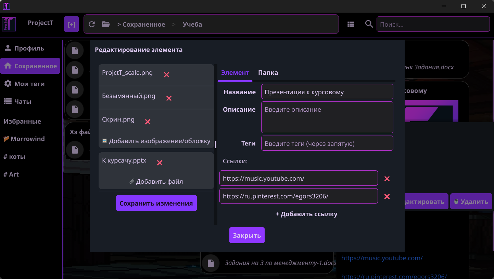

<div align="center">

# ProjectT

### 🗂️ Гибрид Проводника и Pinterest на стероидах

[](https://go.dev/)
[](https://fyne.io/)
[](https://www.sqlite.org/)
[](https://libp2p.io/)

**Это гибрид Проводника и Pinterest, где объекты живут как смысловые единицы, а не как разрозненные файлы, и с P2P-обменом, чтобы делиться коллекциями без потери приватности.**

</div>

---

## 📊 Технологии

- **UI** - Fyne с кастомной темой, виджетами карточек и адаптивной сеткой
- **Бизнес-логика** - сервисы для работы с элементами, тегами, избранным, закреплёнными
- **Хранилище** - SQLite для метаданных + файловая система для контента
- **P2P** - libp2p для децентрализованного обмена (в разработке)

---

## 📖 О проекте

**ProjectT** - это попытка скрестить удобство проводника с визуальностью Pinterest, но без их ограничений.

В проводнике муторно хранить связанные вещи:  
картинка лежит отдельно, описание к ней - в `.txt`, ссылка — вообще в другом месте.

В Pinterest нельзя добавить стихи или документ - только картинки.

Здесь **объект — это целое**.  
Одна карточка может содержать:
- изображение
- текст (стихи, описание)
- ссылку
- любой файл

И всё это привязано друг к другу тегами, а не разбросано по папкам.

---

## 📸 Скриншоты




---

## ✨ Возможности

- **Карточки-контейнеры** — единый формат для файлов, ссылок, текста и картинок  
  (аудио и видео в разработке)
- **Умные теги** — группировка без папок: цветные, с автодополнением
- **Локальное хранилище** — всё живёт у вас, никаких облаков и подписок
- **Сетка в стиле Pinterest** — адаптивная, с изменением размера карточек
- **Поиск и сортировка** — по тегам, названию, дате, типу
- **Избранное и закреплённые** — для быстрого доступа

**В дипломной версии:**  
P2P-обмен коллекциями напрямую между пользователями, без сервера.

---

## ⛓️ Запуск

Скачай последний [релиз](https://github.com/твой-ник/projectT/releases) и запусти `projectT.exe`.

---

## ❓ FAQ

**Где хранятся данные?**  
- Метаданные: `projectT.db`  
- Файлы: `storage/files/`

**Как устроен контент внутри карточки?**  
Каждый элемент — это карточка с контент-блоками.  
Блоки сериализуются в JSON и сохраняются в поле `content_meta`.  
Пример:
```json
{
  "type": "image|file|link|text",
  "content": "текст или ссылка",
  "file_hash": "sha256-хэш файла",
  "original_name": "имя файла",
  "extension": "расширение"
}
```

**Как обеспечивается целостность файлов?** 
При сохранении файла:   
- Вычисляется SHA-256 хэш содержимого
- Файл сохраняется с именем, равным хэшу
- При чтении хэш сверяется с именем файла
Это исключает дубликаты и ускоряет поиск

---

## 👨‍💻 Автор

**ProjectT** это дипломный проект в портфолио студента-программиста на последнем курсе обучения, то есть меня.
  
Параллельно ищу работу разработчика. Умею проектировать архитектуру, работать с GUI и базами данных, разбираюсь в P2P и частично криптографии.
Есть идеи, предложения или просто какой то вопрос? Добро пожаловать в мои личные сообщения

Telegram - @Redoranar

Если интересно у меня ещё и пинтерест есть https://ru.pinterest.com/egors3206/

---

<div align="center">

**Это не замена проводнику. Это новое децентрализованное пространство для тех, кто собирает, хранит, вдохновляется.**
</div>