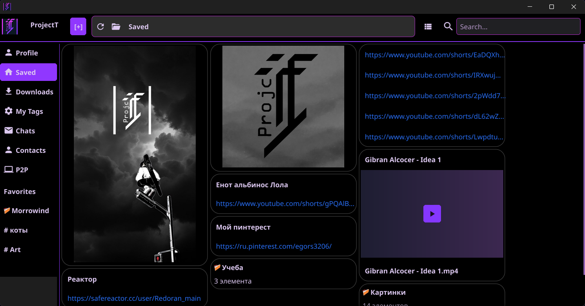
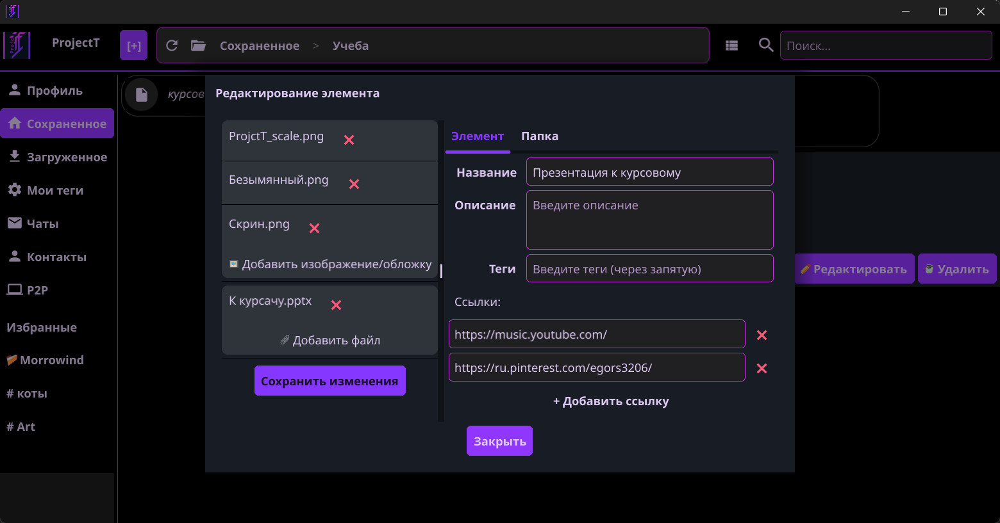
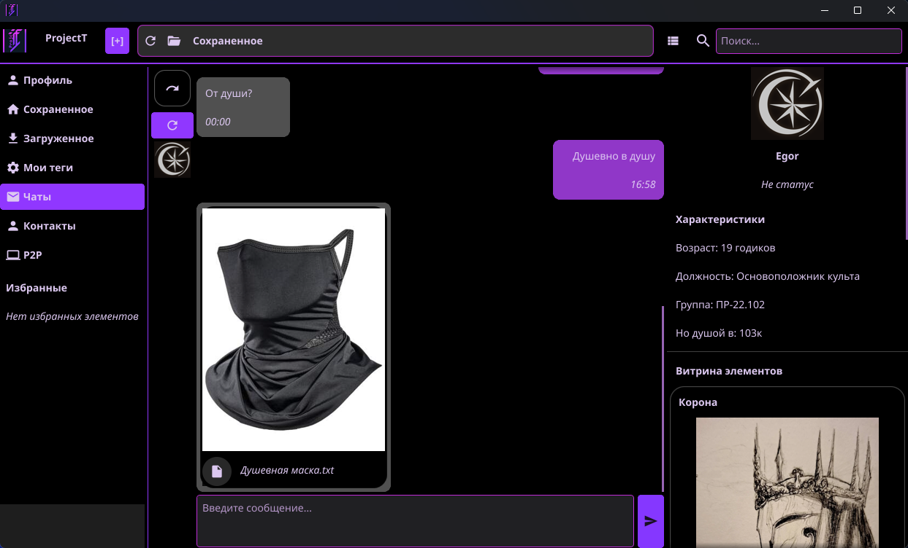

<div align="center">

# ProjectT

### 🗂️ Гибрид Проводника и Pinterest на стероидах

[](https://go.dev/)
[](CHANGELOG.md)
[](https://fyne.io/)
[](https://www.sqlite.org/)
[](https://libp2p.io/)

**Это гибрид Проводника и Pinterest, где объекты живут как смысловые единицы, а не как разрозненные файлы, и с P2P-обменом, чтобы делиться коллекциями без потери приватности.**


</div>

---

## 📊 Технологии

- **UI** - Fyne с кастомной темой, виджетами карточек и адаптивной сеткой
- **Бизнес-логика** - сервисы для работы с элементами, тегами, избранным, закреплёнными
- **Хранилище** - SQLite для метаданных + файловая система для контента
- **P2P** - libp2p для децентрализованного обмена (DHT, relay, STUN)
- **Криптография** - Ed25519 для подписи, SHA-256 для хеширования, XOR шифрование

---

## 📖 О проекте

**ProjectT** - это попытка скрестить удобство проводника с визуальностью Pinterest, но без их ограничений.

В проводнике муторно хранить связанные вещи:  
картинка лежит отдельно, описание к ней - в `.txt`, ссылка — вообще в другом месте.

В Pinterest нельзя добавить стихи или документ - только картинки.

Здесь **объект — это целое**.  
Одна карточка может содержать:
- изображение
- текст (стихи, описание)
- ссылку
- любой файл

И всё это привязано друг к другу тегами, а не разбросано по папкам.

---

## 🟢 Текущее состояние (v0.1.0)

> **Бета-релиз.** Приложение работает, но есть ограничения.

**Уже работает:**
- ✅ Карточки, теги, папки, поиск
- ✅ P2P чат 1-на-1, передача файлов, обмен профилями
- ✅ Обнаружение пиров в одной сети

**Известные проблемы:**
- 🔧 Переходы между вкладками тормозят
- 🔧 Подключение только в одной WiFi-сети
- 🔧 Нет системных уведомлений

**Планы:** стабилизация → групповые чаты → глобальный поиск → каналы → лента

- [Подробная дорожная карта](ROADMAP.md)

---

## 📸 Скриншоты





---

## ✨ Возможности

- **Карточки-контейнеры** — единый формат для файлов, ссылок, текста и картинок  
  (аудио и видео в разработке)
- **Умные теги** — группировка без папок: цветные, с автодополнением
- **Локальное хранилище** — всё живёт у вас, никаких облаков и подписок
- **Сетка в стиле Pinterest** — адаптивная, с изменением размера карточек
- **Поиск и сортировка** — по тегам, названию, дате, типу
- **Избранное и закреплённые** — для быстрого доступа

**P2P-функционал:**
- **Чат между пирами** — текстовые сообщения с шифрованием
- **Передача файлов** — напрямую между пользователями
- **Обмен профилями** — автоматическая синхронизация при подключении
- **Обнаружение пиров** — DHT, mDNS, bootstrap-узлы
- **Безопасность** — мастер-пароль, криптографические ключи, чёрный список
- **Оффлайн-режим** — очередь сообщений для недоступных пиров

---

## ⛓️ Запуск

Скачай последний [релиз](https://github.com/Drekard/projectT/releases) и запусти `projectT.exe`.

---

## ❓ FAQ

**Как соединить два устройства?**  
На данный момент для соединения не обходимо быть подключенным к одной сети Wi-Fi на обоих устройствах.
Для соединения неоходимо на вкладке P2P скопировать свой локальный адрес и передать его на второе устройство, вставив адрес в строку подключения на той же вкладке.
Теперь вы можете начать чат между устройствами, обменяться профилями и своими элементами через чат.

**Где хранятся данные?**  
- Метаданные: `projectT.db`  
- Файлы: `storage/files/`

**Как устроен контент внутри карточки?**  
Каждый элемент — это карточка с контент-блоками.  
Блоки сериализуются в JSON и сохраняются в поле `content_meta`.  
Пример:
```json
{
  "type": "image|file|link|text",
  "content": "текст или ссылка",
  "file_hash": "sha256-хэш файла",
  "original_name": "имя файла",
  "extension": "расширение"
}
```

**Как обеспечивается целостность файлов?** 
При сохранении файла:   
- Вычисляется SHA-256 хэш содержимого
- Файл сохраняется с именем, равным хэшу
- При чтении хэш сверяется с именем файла
Это исключает дубликаты и ускоряет поиск

**Как работает P2P-чат?** 
ProjectT использует libp2p для прямого соединения между пользователями. 
Обнаружение пиров — через DHT (глобально) и mDNS (локально). 
Сообщения шифруются и подписываются криптографическими ключами.
Подробнее — в [FEATURES.md](FEATURES.md#-p2p-чат-и-обмен).

---

## 📚 **Подробнее:**

- [Полный список возможностей](FEATURES.md)
- [Архитектура проекта](ARCHITECTURE.md)
- [Возможности этой версии](CHANGELOG.md)

---

## 👨‍💻 Автор

**ProjectT** это дипломный проект в портфолио студента-программиста на последнем курсе обучения, то есть меня.
  
Параллельно ищу работу разработчика. Умею проектировать архитектуру, работать с GUI и базами данных, реализовал полноценный P2P-мессенджер на libp2p с шифрованием и синхронизацией данных.

Есть идеи, предложения или просто какой то вопрос? Добро пожаловать в мои личные сообщения

Telegram - @Redoranar

Если интересно у меня ещё и пинтерест есть https://ru.pinterest.com/egors3206/

---

<div align="center">

**Это не замена проводнику. Это новое децентрализованное пространство для тех, кто собирает, хранит, вдохновляется.**
</div>